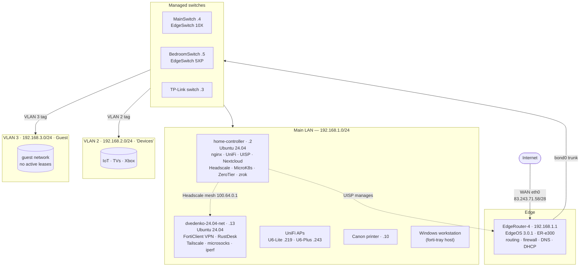

# Network Topology

_Last verified by live sweep: 2026-06-14._

## Diagram

## WAN

| Field | Value |
|-------|-------|
| Interface | `eth0` on EdgeRouter-4 |
| Public IP | `83.243.71.58/28` |
| DDNS name | `local.crsib.me` → public IP |
| IPv6 | link-local only observed (`fe80::…`); no public v6 confirmed |

## Subnets / VLANs

| Network | Gateway | Interface | Role |
|---------|---------|-----------|------|
| `192.168.1.0/24` | `192.168.1.1` | `bond0` (eth2+eth3 bonded) | **Main LAN** — servers, workstations, APs, most clients |
| `192.168.2.0/24` | `192.168.2.1` | `bond0.2` | **VLAN 2 "Devices"** — IoT, smart TVs, game consoles |
| `192.168.3.0/24` | `192.168.3.1` | `bond0.3` | **VLAN 3 — Guest network** (no active leases at sweep) |

A **second WAN** (`eth1`) is provisioned on the router but currently down — see
[hosts/edgerouter-4.md](hosts/edgerouter-4.md).

> **VLAN assignment:** the UniFi SSIDs are **untagged** (Default/LAN), so VLAN 2/3
> segmentation is done at the **managed switches** (EdgeSwitch `.4`/`.5`, TP-Link
> `.3`) via per-port VLAN profiles — not by Wi-Fi. No guest SSID exists, so guest
> access is wired/port-based. Details in
> [hosts/edgerouter-4.md](hosts/edgerouter-4.md).

`eth1` is **down** (unused). DHCP scopes, inter-VLAN firewall policy, and
port-forwards live in the EdgeRouter config — see
[hosts/edgerouter-4.md](hosts/edgerouter-4.md).

## Host inventory

Static/known hosts on the main LAN. Items marked _(unverified)_ come from the
SSH config or historical records and were not re-confirmed in the last sweep.

| IP | Hostname | OS / device | Role | SSH user |
|----|----------|-------------|------|----------|
| `192.168.1.1` | EdgeRouter-4 | EdgeOS 3.0.1 (Debian 9, MIPS64) | Router / firewall / DNS / DHCP | `ubnt` |
| `192.168.1.2` | home-controller | Ubuntu 24.04.4 (kernel 6.8) | Services host | `dvedenko` |
| `192.168.1.3` | TP-Link switch | TP-Link managed switch (MAC `b0:95:75:…`) | L2 switch (web UI on `:80`) | — |
| `192.168.1.4` | MainSwitch | Ubiquiti **EdgeSwitch 10X** (MAC `18:e8:29:…`) | L2 switch — UISP-managed | web only |
| `192.168.1.5` | BedroomSwitch | Ubiquiti **EdgeSwitch 5XP** PoE (MAC `e0:63:da:…`) | L2 switch — UISP-managed | web only |
| `192.168.1.10` | printer | **Canon** printer (MAC `9c:93:4e:…`) | Printing | — |
| `192.168.1.13` | dvedenko-24.04-net | Ubuntu 24.04.4 (kernel 6.17) | Remote-access / VPN box | `dvedenko` |
| `192.168.1.219` | U6-Lite | UniFi AP (DHCP) | Wi-Fi | — |
| `192.168.1.243` | U6-Plus | UniFi AP (DHCP) | Wi-Fi | — |
| `192.168.1.17` | MacBook _(unverified)_ | macOS | Workstation | `dvedenko` |
| `192.168.1.18` | MacBook-16 _(unverified)_ | macOS | Workstation | `d.vedenko` |
| `192.168.1.127` | UbuntuStudio _(unverified)_ | Ubuntu | Workstation | `dvedenko` |
| `192.168.1.165` | OrangePi _(unverified)_ | SBC | — | `dvedenko` |

> The main LAN has ~30 active DHCP clients (phones, smart-home gear, Yandex
> stations, etc.); only infrastructure and pinned hosts are listed here. The
> Windows workstation hosting this repo and `forti-tray` is also on the main LAN.
> UniFi APs receive DHCP addresses (`.219`, `.243`) — the old static `ap-hallway`
> at `.3` no longer applies.

## Overlay / off-LAN networks

These ride on top of the physical LAN — details in
[services/overlay-and-remote-access.md](services/overlay-and-remote-access.md).

- **Headscale / Tailscale** — self-hosted control plane on `home-controller`
  (`headscale.crsib.me`); mesh `100.64.0.0/10`. Node `dvedenko-24` = `.13` @
  `100.64.0.1`.
- **ZeroTier** — `home-controller` is a member (node `09fe4d687b`).
- **zrok** (OpenZiti) — public share tunnels from `home-controller` for `unms`,
  `router`, and `uisp`.
- **FortiClient VPN (`2GIS`)** — corporate tunnel terminated on `192.168.1.13`
  (`fctvpn*` interface; corp DNS `10.54.68.68` / `10.54.129.129`).
- **Off-site UDP relay** — nginx on `.2` forwards inbound **UDP/443** to an external
  Aeza VPS (`104.238.29.139:55444`); see
  [services/reverse-proxy-and-certs.md](services/reverse-proxy-and-certs.md).
