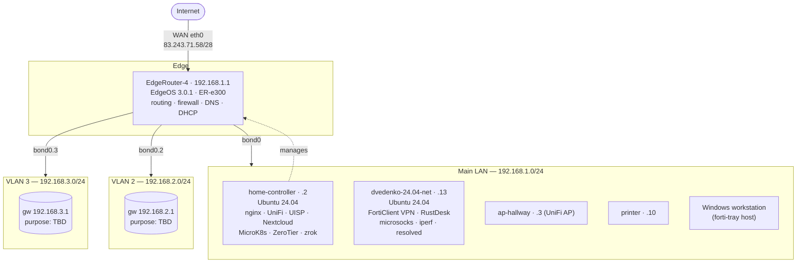

# Network Topology

_Last verified by live sweep: 2026-06-14._

## Diagram

## WAN

| Field | Value |
|-------|-------|
| Interface | `eth0` on EdgeRouter-4 |
| Public IP | `83.243.71.58/28` |
| DDNS name | `local.crsib.me` → public IP |
| IPv6 | link-local only observed (`fe80::…`); no public v6 confirmed |

## Subnets / VLANs

| Network | Gateway | Interface | Role |
|---------|---------|-----------|------|
| `192.168.1.0/24` | `192.168.1.1` | `bond0` (eth2+eth3 bonded) | **Main LAN** — all documented hosts live here |
| `192.168.2.0/24` | `192.168.2.1` | `bond0.2` | VLAN 2 — _purpose TBD_ |
| `192.168.3.0/24` | `192.168.3.1` | `bond0.3` | VLAN 3 — _purpose TBD_ |

`eth1` is **down** (unused). DHCP scopes, inter-VLAN firewall policy, and
port-forwards live in the EdgeRouter config — see
[hosts/edgerouter-4.md](hosts/edgerouter-4.md).

## Host inventory

Static/known hosts on the main LAN. Items marked _(unverified)_ come from the
SSH config or historical records and were not re-confirmed in the last sweep.

| IP | Hostname | OS / device | Role | SSH user |
|----|----------|-------------|------|----------|
| `192.168.1.1` | EdgeRouter-4 | EdgeOS 3.0.1 (Debian 9, MIPS64) | Router / firewall / DNS / DHCP | `ubnt` |
| `192.168.1.2` | home-controller | Ubuntu 24.04.4 (kernel 6.8) | Services host | `dvedenko` |
| `192.168.1.3` | ap-hallway | UniFi AP _(unverified)_ | Wi-Fi access point | — |
| `192.168.1.10` | printer | Network printer _(unverified)_ | Printing | — |
| `192.168.1.13` | dvedenko-24.04-net | Ubuntu 24.04.4 (kernel 6.17) | Remote-access / VPN box | `dvedenko` |
| `192.168.1.17` | MacBook _(unverified)_ | macOS | Workstation | `dvedenko` |
| `192.168.1.18` | MacBook-16 _(unverified)_ | macOS | Workstation | `d.vedenko` |
| `192.168.1.127` | UbuntuStudio _(unverified)_ | Ubuntu | Workstation | `dvedenko` |
| `192.168.1.165` | OrangePi _(unverified)_ | SBC | — | `dvedenko` |

> The Windows workstation that hosts this repo and the `forti-tray` agent is also
> on the main LAN (DHCP; IP not pinned here).

## Overlay / off-LAN networks

These ride on top of the physical LAN — details in
[services/overlay-and-remote-access.md](services/overlay-and-remote-access.md).

- **ZeroTier** — `home-controller` is a member (node `09fe4d687b`).
- **zrok** (OpenZiti) — public share tunnels from `home-controller` for `unms`,
  `router`, and `uisp`.
- **FortiClient VPN (`2GIS`)** — corporate tunnel terminated on `192.168.1.13`
  (`fctvpn*` interface; corp DNS `10.54.68.68` / `10.54.129.129`).
